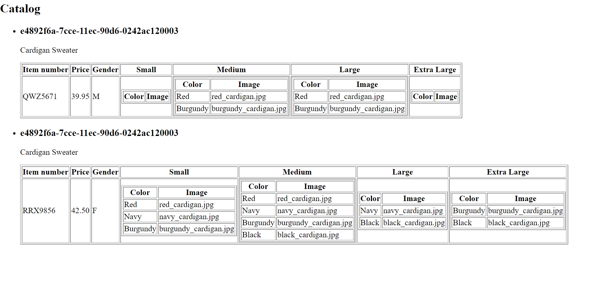

# Assignment

the addition of data in the element makes an xml while the styling of an xml is the xsl, the xpath is the most important phase in an xsl designed to support a data in an xsl document,in each step of the xml was linked to the xsl file transforming each to an html file.